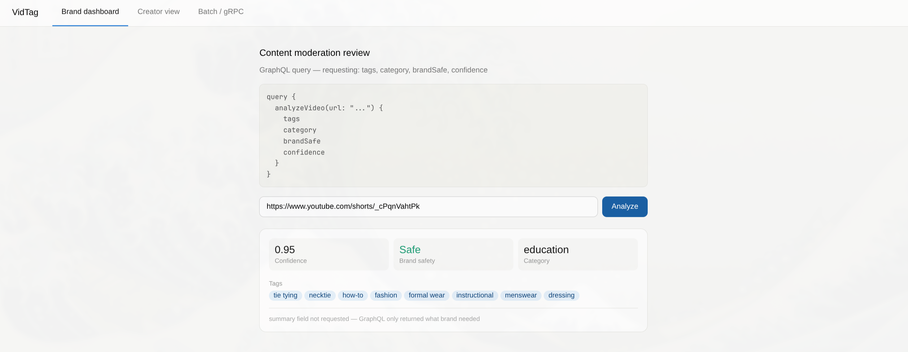
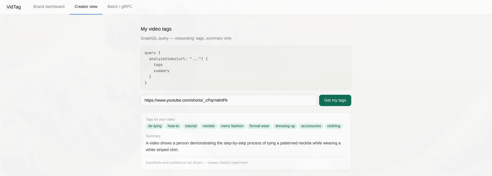
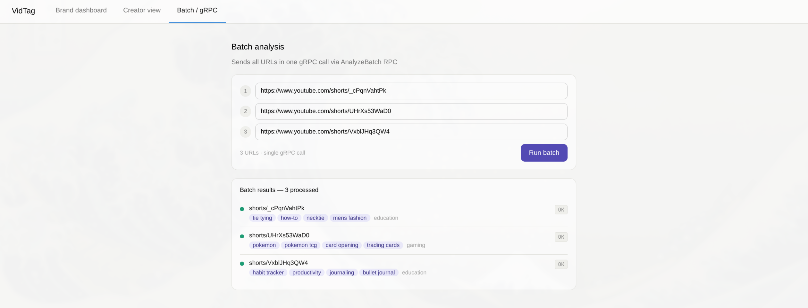

# VidTag

AI-powered UGC video metadata tagging API and dashboard. Given any YouTube or video URL, VidTag extracts keyframes, analyzes them with Gemini Vision, and returns structured tags, category, brand-safety score, and summary — exposed via REST, GraphQL, and gRPC, with a React frontend demonstrating all three.

**Backend:** FastAPI · Strawberry GraphQL · gRPC · Gemini 2.5 Flash · OpenCV · yt-dlp  
**Frontend:** React · Vite · Apollo Client

---

## Demo

<!-- Replace the paths below with your actual screenshot filenames -->
<!-- Recommended: take screenshots of all three tabs and save to examples/ -->

### Brand dashboard — GraphQL (fields: tags, category, brandSafe, confidence)



### Creator view — GraphQL (fields: tags, summary only)



### Batch panel — gRPC via AnalyzeBatch RPC



---

## Sample output

```json
{
  "results": [
    {
      "url": "https://www.youtube.com/shorts/_cPqnVahtPk",
      "tags": [
        "tie tying",
        "necktie",
        "fashion tutorial",
        "menswear",
        "formal attire",
        "style guide",
        "how-to",
        "clothing accessory",
        "professional wear"
      ],
      "category": "education",
      "brand_safe": true,
      "confidence": 0.949999988079071,
      "summary": "A person demonstrates the step-by-step process of tying a necktie, possibly a complex knot or involving multiple ties, with instructional graphics overlaying the video.",
      "error": ""
    },
    {
      "url": "https://www.youtube.com/shorts/UHrXs53WaD0",
      "tags": [
        "pokemon",
        "trading cards",
        "card opening",
        "tcg",
        "collectibles",
        "unified minds",
        "pokemon gx",
        "hobby",
        "unboxing"
      ],
      "category": "gaming",
      "brand_safe": true,
      "confidence": 0.949999988079071,
      "summary": "A person opens Pokemon trading card packs from the Unified Minds set, showcasing various collectible cards.",
      "error": ""
    },
    {
      "url": "https://www.youtube.com/shorts/VxblJHq3QW4",
      "tags": [
        "habit tracking",
        "bullet journal",
        "productivity",
        "planning",
        "organization",
        "how-to",
        "daily habits",
        "journaling",
        "personal growth"
      ],
      "category": "education",
      "brand_safe": true,
      "confidence": 0.9800000190734863,
      "summary": "This video demonstrates how to set up and use a personal habit tracker and bullet journal for organizing daily tasks and tracking memorable moments.",
      "error": ""
    }
  ]
}
```

---

## Architecture

```
Client (React)
    │
    ├── Apollo Client → POST /graphql  ──→ Strawberry GraphQL
    ├── fetch         → POST /analyze  ──→ FastAPI REST
    └── fetch         → POST /batch    ──→ FastAPI → gRPC (port 50051)
                                                │
                                         VidTagServicer
                                                │
                               ┌────────────────┴─────────────────┐
                          yt-dlp download              OpenCV frame extract
                                                              │
                                                     Gemini 2.5 Flash Vision
                                                              │
                                                       VideoResult JSON
```

---

## Backend setup

```bash
git clone https://github.com/YOUR_USERNAME/vidtag
cd vidtag
python -m venv venv && source venv/bin/activate
pip install -r requirements.txt

# Add your free Gemini API key (https://aistudio.google.com/app/apikey)
cp .env.example .env
# Edit .env: GEMINI_API_KEY=your_key_here

uvicorn app.main:app --reload
# API running at localhost:8000
# gRPC server starts automatically on port 50051
```

---

## Frontend setup

```bash
cd vidtag-frontend
npm install
npm run dev
# Dashboard running at localhost:5173
```

> Requires backend running at `localhost:8000`.

---

## REST API

**POST** `/analyze` — analyze a single video URL.

```bash
curl -X POST localhost:8000/analyze \
  -H "Content-Type: application/json" \
  -d '{"url":"https://www.youtube.com/shorts/VALID_ID"}'
```

Response:

```json
{
  "url": "https://www.youtube.com/shorts/VALID_ID",
  "tags": ["cooking", "quick-recipe", "pasta", "italian", "homemade"],
  "category": "food",
  "brand_safe": true,
  "confidence": 0.91,
  "summary": "A creator shows a quick pasta recipe with fresh ingredients."
}
```

---

## GraphQL

Open `localhost:8000/graphql` for the interactive GraphiQL playground.

**Why GraphQL?** Different clients request only the fields they need — the brand dashboard requests `tags`, `category`, `brandSafe`, `confidence` while the creator view requests only `tags` and `summary`. Same endpoint, same backend logic, different shaped responses.

```bash
# Brand query — moderation fields only
curl -X POST localhost:8000/graphql \
  -H "Content-Type: application/json" \
  -d '{"query":"{ analyzeVideo(url: \"URL_HERE\") { tags category brandSafe confidence } }"}'

# Creator query — display fields only
curl -X POST localhost:8000/graphql \
  -H "Content-Type: application/json" \
  -d '{"query":"{ analyzeVideo(url: \"URL_HERE\") { tags summary } }"}'
```

---

## gRPC (batch)

Send multiple URLs in a single `AnalyzeBatch` RPC call — designed for high-throughput pipelines where REST would mean N individual requests.

```bash
# Smoke test — edit URLs in scripts/test_grpc.py first
python scripts/test_grpc.py
```

Example output:

```
URL:      https://www.youtube.com/shorts/abc123
Tags:     travel, bali, vlog, sunset, outdoor
Category: travel
Safe:     True
Summary:  A creator films a sunset timelapse from a Bali clifftop.

URL:      https://www.youtube.com/shorts/xyz789
Tags:     fitness, home-workout, no-equipment, beginner, core
Category: fitness
Safe:     True
Summary:  A quick 5-minute core workout routine requiring no equipment.
```

**Frontend batch panel** calls `/batch` (a REST proxy that internally routes through gRPC), since browsers cannot speak gRPC directly over HTTP/2.

---

## Rate limiting

| Endpoint                   | Limit                            |
| -------------------------- | -------------------------------- |
| `POST /analyze` (REST)     | 5 requests / minute per IP       |
| `POST /graphql`            | 5 requests / minute per IP       |
| `POST /batch` (gRPC proxy) | No limit — designed for bulk use |

---

## Project structure

```
vidtag/
├── app/
│   ├── main.py              # FastAPI app + gRPC server startup
│   ├── config.py            # Environment config
│   ├── models.py            # Pydantic models
│   ├── graphql_schema.py    # Strawberry schema
│   ├── routes/
│   │   ├── analyze.py       # POST /analyze
│   │   └── batch.py         # POST /batch (gRPC proxy)
│   ├── services/
│   │   ├── video.py         # yt-dlp + OpenCV pipeline
│   │   ├── gemini.py        # Gemini Vision API
│   │   └── grpc_server.py   # gRPC servicer + run_batch helper
│   └── proto/
│       └── vidtag.proto     # Protobuf service definition
├── scripts/
│   └── test_grpc.py         # gRPC smoke test client
├── examples/                # Sample outputs and screenshots
├── frontend/                # React dashboard
│   └── src/
│       ├── sections/
│       │   ├── BrandDashboard.jsx
│       │   ├── CreatorView.jsx
│       │   └── BatchPanel.jsx
│       └── App.jsx
└── README.md
```

---

## Environment variables

| Variable         | Description                        | Default       |
| ---------------- | ---------------------------------- | ------------- |
| `GEMINI_API_KEY` | Free key from aistudio.google.com  | required      |
| `TEMP_DIR`       | Temp directory for video downloads | `/tmp/vidtag` |
| `MAX_FRAMES`     | Keyframes extracted per video      | `5`           |
| `GRPC_PORT`      | gRPC server port                   | `50051`       |
